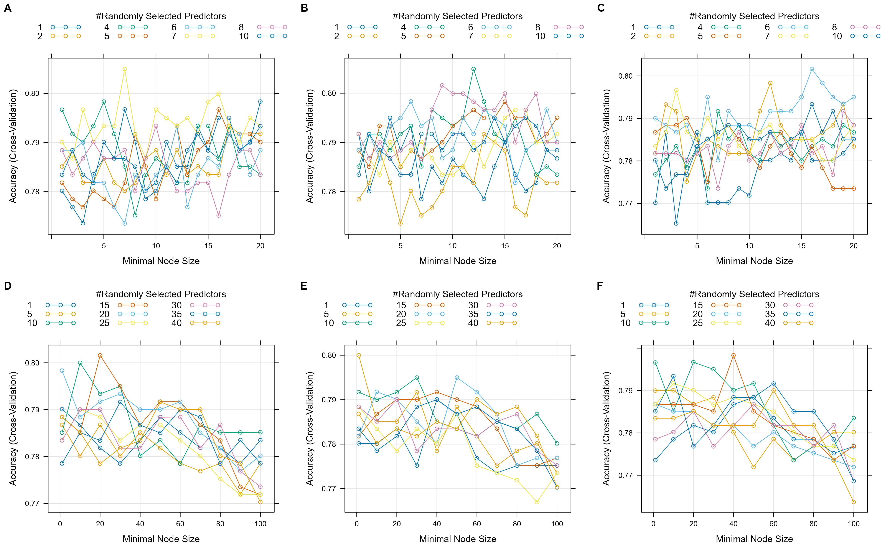

```{r libs, include = F}
source("../R/check_pkg.R")
pkgs <- c("ggplot2", "dplyr", "tidyverse", "cowplot", "pheatmap", "vcd", "gridExtra", "pROC", "ranger")
check_pkg(pkgs)
```


# 1. Simple model
To begin, a simple Random Forest model was trained for the binary categorical variable `waterlog.100`, indicating whether the soil is waterlogged at 100 cm depth. The code containing all model trainings can be found in the analysis folder in the file `Soil_RF_models.R`
```{r simple_model, echo = F, fig.cap = "Figure 1: Variable importance based on OOB."}
# Load random forest model
rf_basic <- readRDS(here::here("data/rf_basic_waterlog100.rds"))

# Load the data
df_full <- readRDS(here::here("data/df_full.rds")) |>
  mutate(waterlog.30 = as.factor(waterlog.30),
         waterlog.50 = as.factor(waterlog.50),
         waterlog.100 = as.factor(waterlog.100))

# Split dataset into training and testing sets
df_test  <- df_full |> dplyr::filter(dataset == "validation") |> tidyr::drop_na()

# Extract the variable importance and create a long tibble
vi_rf_basic <- rf_basic$variable.importance |>
  dplyr::bind_rows() |> 
  tidyr::pivot_longer(cols = dplyr::everything(), names_to = "variable")

# Plot variable importance, ordered by decreasing value
vi_rf_basic |> 
  ggplot2::ggplot(ggplot2::aes(x = reorder(variable, value), y = value)) +
  ggplot2::geom_bar(stat = "identity", fill = "grey50", width = 0.75) + 
  ggplot2::labs(
    y = "Change in OOB MSE after permutation", 
    x = "",
    title = "Variable importance based on OOB") +
  ggplot2::theme_classic() +
  ggplot2::coord_flip()
```


# 2. Variable selection
As explained in the tutorial, the Boruta algorithm is used to perform a variable selection based on the variable importance (Kursa & Rudnicki, 2010).

```{r boruta, class.source = "fold-hide", fig.cap = "Figure 2: Variable importance based on Boruta."}
# load the Boruta object
bor <- readRDS(here::here("data/boruta_waterlog100.rds"))
  
# obtain results: a data frame with all variables, ordered by their importance
df_bor <- Boruta::attStats(bor) |> 
  tibble::rownames_to_column() |> 
  dplyr::arrange(dplyr::desc(meanImp))

# plot the importance result  
ggplot2::ggplot(ggplot2::aes(x = reorder(rowname, meanImp), 
                             y = meanImp,
                             fill = decision), 
                data = df_bor) +
  ggplot2::geom_bar(stat = "identity", width = 0.75) + 
  ggplot2::scale_fill_manual(values = c("grey30", "tomato", "grey70")) + 
  ggplot2::labs(
    y = "Variable importance", 
    x = "",
    title = "Variable importance based on Boruta") +
  ggplot2::theme_classic() +
  ggplot2::coord_flip()

# get retained important variables
predictors_selected <- df_bor |> 
  dplyr::filter(decision == "Confirmed") |>
  dplyr::pull(rowname)

print(paste(length(predictors_selected)," of ", nrow(df_bor), " variables were judged `confirmed` by the Boruta algorithm."))
```

Let's see which ones these were compared to the variable importance of the simple model:

```{r boruta_vi, echo = F, fig.cap = "Figure 3: Original VI and Variables chosen by Boruta."}
df_bor_iv_basic <- df_bor |>
  rename(variable = rowname) |>
  full_join(vi_rf_basic, by='variable') |>
  rename(vi_original = value)

# plot the importance result  
ggplot2::ggplot(ggplot2::aes(x = reorder(variable, vi_original), 
                             y = vi_original,
                             fill = decision), 
                data = df_bor_iv_basic) +
  ggplot2::geom_bar(stat = "identity", width = 0.75) + 
  ggplot2::scale_fill_manual(values = c("grey30", "tomato", "grey70")) + 
  ggplot2::labs(
    y = "Original Variable importance", 
    x = "",
    title = "Original VI and Variables chosen by Boruta") +
  ggplot2::theme_classic() +
  ggplot2::coord_flip()
```

The Random Forest is the retrained using only the variables selected by the Boruta algorithm.

# 3. Model optimization
To optimize the hyperparameters `mtry` and `min.node.size`, I used grid hyperparameter tuning and a 5-fold cross-validation. The grid is passed to the train()-function via the tuneGrid argument, as shown in chapter 11 of the AGDS I book. The code is stored in the analysis folder.
The definitions of these two hyperparameters, according to AGDS I book, are:  
* mtry: The number of variables to consider to make decisions at each node, often taken as p/3 for regression, where p is the number of predictors. Default is the (rounded down) square root of the number variables, so 6 in our case
* min.node.size: The number of data points at the “bottom” of each decision tree, i.e. the leaves. Default 1 for classification.

The hyperparameter tuning turned out to be rather uneffective. I performed multiple model runs with the same tuning grid and different seed values. As can be seen on the 6 example figures below, the accuracy of the hyperparameter combination quite random for min.node.size between 1 and 20 and for mtry between 1 and 10. When expanding the ranges of the two hyperparameters, we can see that the values start to minimize after a min.node.size of roughly.
```{r, fig.cap = "Figure 4: Six different runs of hyperparameter tuning.", echo = F}

```

I decided to take the combination of hyperparameters that had the biggest accuracy out of all the six tuning runs: 
mtry = 4 and min.node.size = 12 (Fig. 4B).
This means, that the corresponding seed value also has to be used, when calculating the final model.


# 4. Model evaluation and comparison
We can now compare the simple model and the retrained model after variable selection.
Since the waterlog.100 is a binary categorical variable, we need to use metrics for classification, that indicate how many validation sites are correctly classified as either TRUE or FALSE. This is represented in a confusion matrix. 

For the interpretation of the metrics, it is important to check if the testing data is balanced in terms of observed TRUE and FALSE values.

```{r balance, echo = F}
# Assuming your dataframe is named 'df' and the binary factor variable is named 'binary_var'
# Replace 'df' and 'binary_var' with your actual dataframe and variable names

# Create a table of counts for the binary variable
table_counts <- as.data.frame(table(df_test$waterlog.100))

print(paste("The validation dataset contains ", table_counts[2,2], " TRUE and ", table_counts[1,2], " FALSE values of waterlog.100"))

# Calculate the balance ratio
balance_ratio <- table_counts[2,2] / table_counts[1,2]

# Display the balance ratio
print(paste("This is a Balance Ratio of: ", round(balance_ratio, digits = 2)))

```
A balance ratio close to 1 would indicate balanced data. In our case, there are more FALSE values. When interpreting the metrics, we have to be aware of that. Accuracy is not the best metric for imbalanced data: always predicting FALSE would lead to a higher accuracy than always predicting TRUE. Therefore, other, more robust metrics such as Kappa, F1 Score and the True Positive Rate (Sensitivity) should be considered.


```{r predictions, class.source = "fold-hide"}
# Load random forest model
rf_bor   <- readRDS(here::here("data/rf_bor_waterlog100.rds"))
rf_opt   <- readRDS(here::here("data/rf_opt_waterlog100.rds"))

# Make predictions for validation sites using the 2 models 
prediction_basic <- predict(
  rf_basic,           # RF model
  data = df_test,   # Predictor data
  num.threads = parallel::detectCores() - 1
  )

prediction_bor <- predict(
  rf_bor,           # RF model
  data = df_test,   # Predictor data
  num.threads = parallel::detectCores() - 1
  )

prediction_opt <- predict(
  rf_opt,           # RF model
  data = df_test,   # Predictor data
  num.threads = parallel::detectCores() - 1
  )

# Save predictions to validation df
df_test$pred_basic <- prediction_basic$predictions
df_test$pred_bor <- prediction_bor$predictions
df_test$pred_opt <- prediction_opt$predictions
```

```{r, include = F, echo = F}
# plot confusion matrix
conf_matrix_basic <- caret::confusionMatrix(data = df_test$pred_basic, reference = df_test$waterlog.100)
conf_matrix_bor <- caret::confusionMatrix(data = df_test$pred_bor, reference = df_test$waterlog.100)
conf_matrix_opt <- caret::confusionMatrix(data = df_test$pred_opt, reference = df_test$waterlog.100)
mosaicplot(conf_matrix_basic$table,
           main = "Confusion matrix simple model")
mosaicplot(conf_matrix_bor$table,
           main = "Confusion matrix Boruta model")
mosaicplot(conf_matrix_opt$table,
           main = "Confusion matrix optimized model")
```

```{r conf_plot_function, include = F, echo = F}
draw_confusion_matrix <- function(cm, title, class1, class2) {

  layout(matrix(c(1,1,2)))
  par(mar=c(2,2,2,2))
  plot(c(100, 345), c(300, 450), type = "n", xlab="", ylab="", xaxt='n', yaxt='n')
  title(title, cex.main=2)

  # create the matrix 
  rect(150, 430, 240, 370, col='#77BB99')
  text(195, 435, class1, cex=1.2)
  rect(250, 430, 340, 370, col='#F7AD50')
  text(295, 435, class2, cex=1.2)
  text(125, 370, 'Predicted', cex=1.3, srt=90, font=2)
  text(245, 450, 'Reference', cex=1.3, font=2)
  rect(150, 305, 240, 365, col='#F7AD50')
  rect(250, 305, 340, 365, col='#77BB99')
  text(140, 400, class1, cex=1.2, srt=90)
  text(140, 335, class2, cex=1.2, srt=90)

  # add in the cm results 
  res <- as.numeric(cm$table)
  text(195, 400, res[1], cex=1.6, font=2, col='white')
  text(195, 335, res[2], cex=1.6, font=2, col='white')
  text(295, 400, res[3], cex=1.6, font=2, col='white')
  text(295, 335, res[4], cex=1.6, font=2, col='white')

  # add in the specifics 
  plot(c(100, 0), c(100, 0), type = "n", xlab="", ylab="", main = "DETAILS", xaxt='n', yaxt='n')
  text(10, 85, names(cm$byClass[1]), cex=1.2, font=2)
  text(10, 70, round(as.numeric(cm$byClass[1]), 3), cex=1.2)
  text(30, 85, names(cm$byClass[2]), cex=1.2, font=2)
  text(30, 70, round(as.numeric(cm$byClass[2]), 3), cex=1.2)
  text(50, 85, names(cm$byClass[5]), cex=1.2, font=2)
  text(50, 70, round(as.numeric(cm$byClass[5]), 3), cex=1.2)
  text(70, 85, names(cm$byClass[6]), cex=1.2, font=2)
  text(70, 70, round(as.numeric(cm$byClass[6]), 3), cex=1.2)
  text(90, 85, names(cm$byClass[7]), cex=1.2, font=2)
  text(90, 70, round(as.numeric(cm$byClass[7]), 3), cex=1.2)

  # add in the accuracy information 
  text(30, 35, names(cm$overall[1]), cex=1.5, font=2)
  text(30, 20, round(as.numeric(cm$overall[1]), 3), cex=1.4)
  text(70, 35, names(cm$overall[2]), cex=1.5, font=2)
  text(70, 20, round(as.numeric(cm$overall[2]), 3), cex=1.4)
}  
```

```{r confmat_plots, echo = F, fig.cap = "Figure 5: Confusion matrix and metrics of the simple model.", fig.width = 4.5, fig.height=4.5}
conf_basic_plot <- draw_confusion_matrix(conf_matrix_basic, "Simple model", "FALSE", "TRUE")
```

```{r confmat_plots2, echo = F, fig.cap = "Figure 6: Confusion matrix and metrics of the Boruta model (after variable selection).", fig.width = 4.5}
conf_bor_plot <- draw_confusion_matrix(conf_matrix_bor, "Boruta model (reduced predictors)", "FALSE", "TRUE")
```

```{r confmat_plots3, echo = F, fig.cap = "Figure 7: Confusion matrix and metrics of the optimized model (after hyperparameter tuning).", fig.width = 4.5}
conf_opt_plot <- draw_confusion_matrix(conf_matrix_opt, "Optimized model", "FALSE", "TRUE")
```

We see that the metrics are overall very similar in all three models (Fig. 5, 6, and 7), indicating that the predictor selection and hyperparameter tuning had not a markedly big impact on model performance. Mhe "Boruta" model (Fig. 6) that uses a reduced set of predictors, but default hyperparameters, performs best in all the analyzed metrics. 
I therefore chose to use this model, for the last step of the analysis.

# 5. Probabilistic predictions
A new, probabilistic model was trained using the default hyperparameters, and the reduced predictor set according to the Boruta selection.
Then, the model is first tested and evaluated on the validation sites (Fig. 8).
The Receiver Operating Characteristic (ROC) curve evaluates the performance of a binary classification model (Fig. 9). The AUC (area under the curve) is 0.809, meaning the model is markedly better than a random model (AUC = 0.5), and not quite as good as a perfect model (AUC = 1).
```{r prob_plot, class.source = "fold-hide", fig.cap = "Figure 8: Predicted probability vs. Observed soil waterlog at 100 cm.", fig.height=2.5}
rf_prob <- readRDS(here::here("data/rf_prob_waterlog100.rds"))
prediction_prob <- predict(
  rf_prob,           # RF model
  data = df_test,   # Predictor data
  num.threads = parallel::detectCores() - 1
  )

# save the predictions that waterlog.100 = TRUE (1)
pred_prob <- prediction_prob$predictions 
df_test$pred_prob <- pred_prob[,2]

# Plot the probability
df_test |> 
  ggplot2::ggplot(ggplot2::aes(x = pred_prob, y = waterlog.100, color = waterlog.100)) +
  ggplot2::geom_point() +
  ggplot2::theme_classic() +
  ggplot2::labs(
    title = "Predicted probability vs. Observed soil waterlog at 100 cm",
    x = "Predicted probability",
    y = "Observed waterlog"
  )
```

```{r roc, class.source = "fold-hide", fig.cap = "Figure 9: ROC curve for soil waterlog at 100 cm."}
# Create the ROC curve
roc_obj <- roc(df_test$waterlog.100, df_test$pred_prob)
# Plot the ROC curve
plot(roc_obj, print.auc=TRUE, auc.polygon=TRUE, grid=c(0.1, 0.1),
grid.col=c("darkgrey", "lightgrey"), max.auc.polygon=TRUE,
auc.polygon.col="#ccffaa", print.thres=F, main = "ROC curve for soil waterlog at 100 cm")
```

Let's map the predicted probability.
The code used to generated the raster files containing the predictions can be found at `analysis/Soil_rasters.R`.
```{r map_raster_prob, echo = F, message = F, fig.cap = "Figure 10: Map of predicted probability of soil waterlogging at 100 cm.", fig.height=2.8}
raster_pred_prob <- terra::rast(here::here("data/predicted_waterlog100_prob.tif"))

ggplot2::ggplot() +
  tidyterra::geom_spatraster(data = raster_pred_prob) +
  ggplot2::scale_fill_viridis_c(
    na.value = NA,
    option = "viridis",
    name = "probability"
  ) +
  ggplot2::theme_classic() +
  ggplot2::scale_x_continuous(expand = c(0, 0)) +
  ggplot2::scale_y_continuous(expand = c(0, 0)) +
  ggplot2::labs(title = "Predicted probability of soil waterlogging (100 cm)")
```

In a last step, the probabilistic prediction is used to make binary prediction maps according to different thresholds. The choice of threshold is essentially a trade-off between false positives and false negatives, which, in my opinion, differs for the two scenarios.
For an infrastructure project where waterlogging would severely jeopardize the stability, the focus should be to minimize false negatives. I did this by setting a very low probability threshold: if there is more than a 1% chance of a soil being waterlogged, then the area is cancelled out in the map of suited areas (Fig. 11). In the scenario where waterlogging is unwanted but not critical (Fig. 12), the focus should be to maximize true negatives while balancing false positives. I therefore chose a 10% threshold, which accepts a 10% risk of the soil to be waterlogged and suggests potential areas. Of course, this is only one possible solution. In a real project, a risk acceptance analysis would help to inform the choice of these thresholds.

A similar-natured problem from another realm is for example the COVID Rapid antigen test (or similar swab tests), where a the liquid has to be sensitive enough to detect virus proteins, but not too sentitive to cause too many false positive tests.

```{r map_raster_thresh1, echo = F, message = F, fig.cap = "Figure 11: Map of predicted soil waterlogging (100 cm), with the threshold of >1% probability.", fig.height=2.8}
raster_pred_1perc <- terra::rast(here::here("data/predicted_waterlog100_1perc.tif"))
raster_pred_10perc <- terra::rast(here::here("data/predicted_waterlog100_10perc.tif"))

ggplot2::ggplot() +
  tidyterra::geom_spatraster(data = raster_pred_1perc) +
  ggplot2::scale_fill_viridis_c(
    na.value = NA,
    option = "viridis",
    name = "waterlog (0 or 1)"
  ) +
  ggplot2::theme_classic() +
  ggplot2::scale_x_continuous(expand = c(0, 0)) +
  ggplot2::scale_y_continuous(expand = c(0, 0)) +
  ggplot2::labs(title = "Predicted soil waterlogging (100 cm), >1% probability")
```

```{r map_raster_thresh2, echo = F, message = F, fig.cap = "Figure 12: Map of predicted soil waterlogging (100 cm), with the threshold of >10% probability.", fig.height=2.8}
ggplot2::ggplot() +
  tidyterra::geom_spatraster(data = raster_pred_10perc) +
  ggplot2::scale_fill_viridis_c(
    na.value = NA,
    option = "viridis",
    name = "waterlog (0 or 1)"
  ) +
  ggplot2::theme_classic() +
  ggplot2::scale_x_continuous(expand = c(0, 0)) +
  ggplot2::scale_y_continuous(expand = c(0, 0)) +
  ggplot2::labs(title = "Predicted soil waterlogging (100 cm), >10% probability")
```


# References
Kursa, M. B., & Rudnicki, W. R. (2010). Feature Selection with the Boruta Package. Journal of Statistical Software, 36(11), 1–13. https://doi.org/10.18637/jss.v036.i11

Robin, X., Turck, N., Hainard, A., Tiberti, N., Lisacek, F., Sanchez, J.-C., & Müller, M.
(2011). pROC: an open-source package for R and S+ to analyze and compare ROC curves. BMC Bioinformatics, 12, 77.
https://doi.org/10.1186/1471-2105-12-77